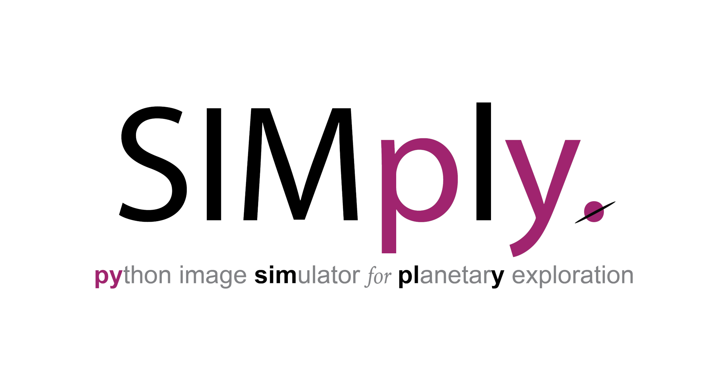

# SIMply: Python Image Simulator for Planetary Exploration
SIMply is an open-source python tool for simulating physically realistic images.
SIMply is designed primarily to support the development of spaceborne cameras by providing a simple and accessible simulation tool for generating images of space scenes.
SIMply can simulate a wide range of spaceborne imaging scenarios (small bodies, moons, planets, artificial objects), and provides a high level of flexibility to customise the camera, scene and rendering engine.
Simulations can be set up intuitively in just a few lines of Python code.

As a physically-based image simulator, SIMply is also suitable for simulating a wide range of imaging scenarios unrelated to space. Thanks to its simple design, SIMply is also a good way to experiment with and learn about physical image simulation.

## Install
Currently, there are two options for installation:
- clone the SIMply repository
- simply download the SIMply source code (select code > download zip) and place the full SIMply package into your project

### Dependencies
In both cases, it is also necessary to ensure the following dependencies are installed:
- [open3D](https://www.open3d.org/)
- [numpy](https://numpy.org/)
- [scipy](https://scipy.org/)
- [openCV](https://opencv.org/)
- [astropy](http://www.astropy.org)
- [pandas](https://pandas.pydata.org/)
- [matplotlib](https://matplotlib.org/)
- [gdal](https://pypi.org/project/GDAL/) (optional, for working with geotifs)

## Usage
See the examples.py file for simple examples of how to set up and run image simulations.

## Acknowledgements

Logo Design: Divya M. Persaud

## Licence
See [LICENCE.txt](LICENCE.txt)